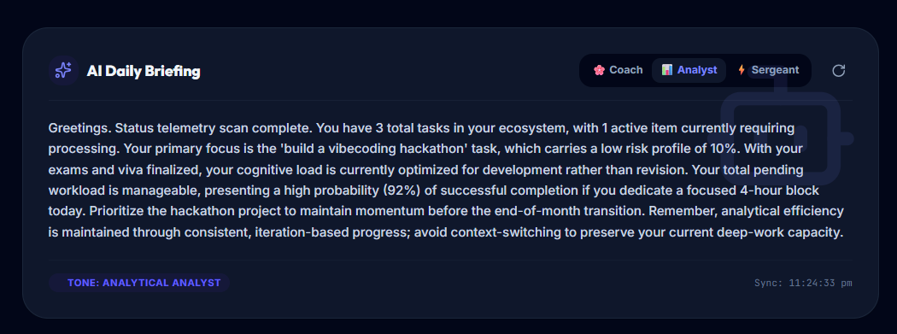
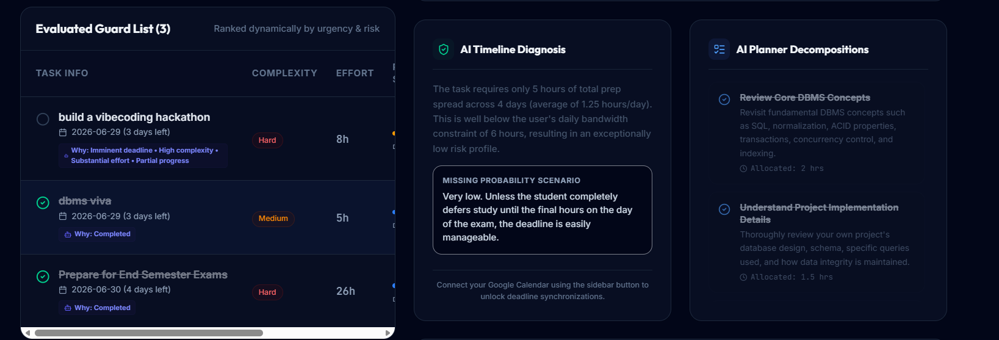
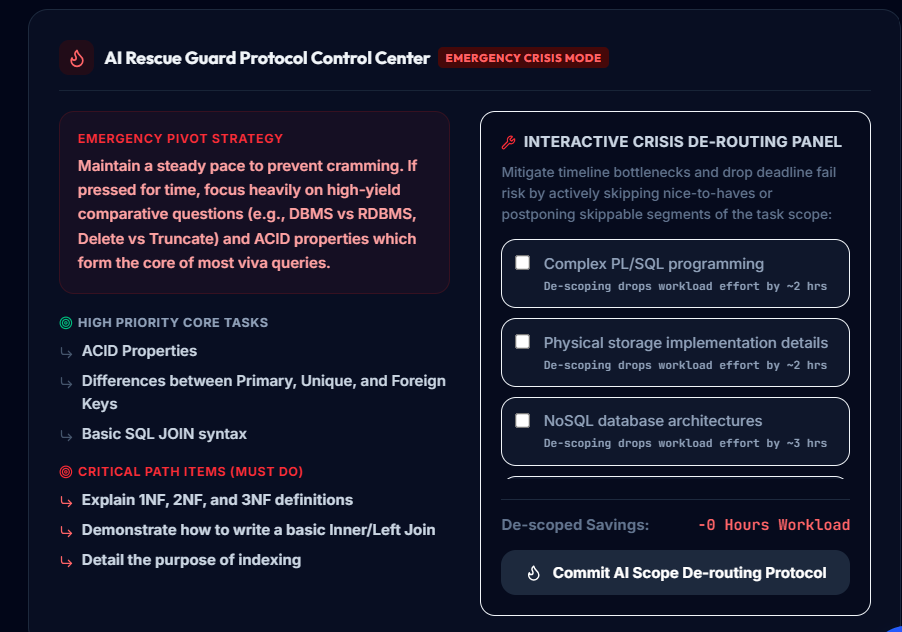
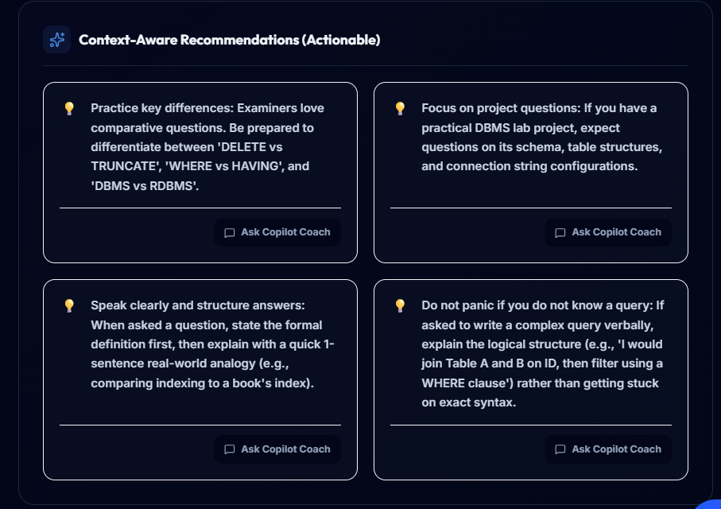
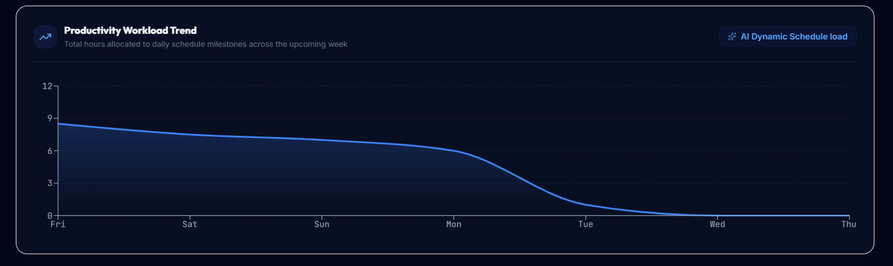
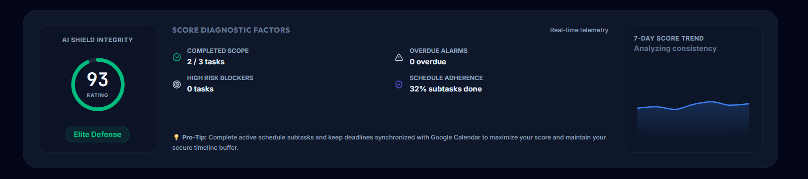

# 🛡️ Deadline Guardian AI
### *The Last-Minute Life Saver* — Google AI Studio Hackathon Submission

[](https://react.dev/)
[](https://vitejs.dev/)
[](https://nodejs.org/)
[](https://firebase.google.com/)
[](https://ai.google.dev/)
[](https://calendar.google.com/)

---

## 📅 Table of Contents
1. [Project Overview](#-project-overview)
2. [Problem Statement](#-problem-statement)
3. [The Solution](#-the-solution)
4. [Key Features](#-key-features)
5. [Screenshots](#-screenshots)
6. [How It Works / Architecture](#-how-it-works--architecture)
7. [Tech Stack](#-tech-stack)
8. [Google Technologies Used](#-google-technologies-used)
9. [Installation Guide](#-installation-guide)
10. [Environment Variables](#-environment-variables)
11. [Running Locally](#-running-locally)
12. [Deployment / Live Demo](#-deployment--live-demo)
13. [Project Roadmap](#-project-roadmap)
14. [Future Enhancements](#-future-enhancements)
15. [Contributing](#-contributing)
16. [License](#-license)
17. [Acknowledgements](#-acknowledgements)
18. [Contact](#-contact)

---

## 📌 Project Overview

**Deadline Guardian AI** is an intelligent, full-stack productivity companion designed for developers, students, and knowledge workers. Built for the Google AI Studio Hackathon, the platform goes beyond static checklists to act as a **proactive guard dog for your time**. By dynamically analyzing task risk factors, distributing subtasks across calendar timelines, and warning users of capacity constraints, Deadline Guardian AI converts chaotic, last-minute panic into structured, micro-scheduled confidence.

The core of Deadline Guardian AI is built on the belief that productivity tools shouldn't just store tasks—they should actively participate in helping you finish them safely and sustainably.

---

## 🚨 Problem Statement

### *The Chaos of "The Last-Minute Life"*
Traditional task managers suffer from a fundamental design flaw: **they are passive containers**. They rely on the user to estimate work hours, break down subtasks, and track their own daily capacity. Under pressure, this leads to:

* **Over-Optimism Bias**: Underestimating the actual hours needed to complete complex projects (e.g. *"I'll write my entire final report tomorrow"*).
* **Timeline Overload**: Spreading out deadlines but piling up actual work on the final days, causing intense stress and late submissions.
* **Invisible Bottlenecks**: Missing conflicts between external calendar obligations (e.g., meetings, exams) and heavy task requirements.
* **Alert Fatigue**: Standard notifications that sound the same for a 5-minute chores checklist as they do for a high-risk project due in 24 hours.

---

## 💡 The Solution

Deadline Guardian AI solves the passive management crisis by introducing an automated, context-aware analysis and planning feedback loop:

```
┌────────────────────────────────────────────────────────┐
│                   Active Guard List                    │
│   (Tasks with Difficulty, Deadlines, & Effort Hours)   │
└───────────────────────────┬────────────────────────────┘
                            │ (Local Task Parameters)
                            ▼
┌────────────────────────────────────────────────────────┐
│            Dynamic Risk & Prioritization Engine        │
│   (5-Dimension Calculations & Capacity Benchmarks)     │
└───────────────────────────┬────────────────────────────┘
                            │ (Urgency & Complexity Ratios)
                            ▼
┌────────────────────────────────────────────────────────┐
│                  Multi-Agent Gemini                    │
│  (Step-by-Step Milestones, Emergency Recovery Plans)   │
└───────────────────────────┬────────────────────────────┘
                            │ (Durable Storage & Sync)
                            ▼
┌────────────────────────────────────────────────────────┐
│      Google Cloud Firestore & Google Calendar Sync     │
└────────────────────────────────────────────────────────┘
```

The application runs a continuous dynamic telemetry check on your tasks, calculates a **Dynamic Priority Score** and **AI Risk Level**, generates step-by-step day-by-day subtask schedules, and pushes them directly into your **Google Calendar** with smart reminder overrides.

---

## ✨ Key Features

### 1. 🌸 AI Daily Briefing & Co-pilot
Every time you open the dashboard, the system generates a tailored tactical summary based on your selected coaching style:
* **Empathic Coach**: Focuses on stress management, encouragement, and sustainable workflow habits.
* **Analytical Analyst**: Gives you precise hourly allocations, metric changes, and mathematical bottlenecks.
* **Drill Sergeant**: High-intensity, direct, and zero-excuses motivation to kickstart procrastination.
* **AI Co-pilot Chat**: An interactive chat overlay allowing you to discuss daily insights directly with the AI, co-generating action steps.

### 2. 📊 Intelligent Task Prioritization
Tasks are ranked dynamically across **five analytical dimensions**:
1. **Deadline Proximity**: Weighted based on actual days remaining.
2. **Task Difficulty**: Complexity coefficients (1.0x Easy, 1.25x Medium, 1.5x Hard).
3. **Estimated Effort Hours**: Absolute load weight of the task.
4. **Completion Ratio**: The progress percentage of individual checklist subtasks.
5. **AI Risk level**: Extra priority weight added for items flagged as High or Medium risk.

### 3. 🗓️ Smart Timeline Planning (Burnout Prevention)
* Automatically takes a high-level goal and distributes subtasks evenly across the calendar leading up to the deadline.
* Prevents "timeline grouping" (no single day is overloaded beyond a safe threshold of daily work hours).
* Shows clear day-by-day workload indicators with smart break interval advice (e.g., Pomodoro iterations or screen-free active stretching breaks).

### 4. ⚡ Mathematical Risk Prediction
The system uses multiple heuristics to calculate and categorize risk:
$$\text{DailyRatio} = \frac{\text{Estimated Effort Hours}}{\text{Days Remaining}}$$
* If the $\text{DailyRatio}$ exceeds your maximum safe daily capacity, the task is automatically flagged as **High Risk** with detailed diagnostic reasoning.
* Automatically provides an **AI Emergency Recovery Plan** for all High-Risk tasks, highlighting descoping advice and focus paths.

### 5. 🔔 Context-Aware Recommendations
Provides live context-driven advice based on your dashboard state:
* *"Your calendar is busy on Wednesday; we recommend completing this task by Tuesday evening."*
* *"High burnout probability detected. Reduce today's workload to avoid fatigue."*
* *"Non-critical tasks of Hard difficulty have been de-scoped."*

---

## 📸 Screenshots

Below are actual visual highlights from the **Deadline Guardian AI** system, showcasing the depth of its user interface and custom-designed widget layouts:

### 1. Full Dashboard Overview

*A look at the master workspace dashboard combining score telemetry, daily tasks, recommendation engines, and calendar status feeds.*

---

### 2. AI Daily Briefing Section

*Proactive morning summary generating personalized tactical action plans. Effortlessly toggle between Coach, Analyst, and Sergeant personality modes.*

---

### 3. Evaluated Guard List, Timeline Diagnosis & Planner Decompositions

*Dynamic prioritization list ranking tasks by imminent deadlines, mathematical effort ratios, and automated AI planner decompositions.*

---

### 4. AI Rescue Guard Protocol Control Center

*Interactive emergency de-scoping cockpit displaying pivot strategies, high-priority lists, and estimated saving hours.*

---

### 5. Context-Aware Recommendations

*Personalized smart recommendations suggesting active micro-steps, revision guides, and targeted focus goals based on your exam parameters.*

---

### 6. Productivity Workload Trend Chart

*Visualizing total hours allocated to daily schedule milestones across the upcoming week using animated Recharts canvas overlays.*

---

### 7. Score Diagnostic Factors

*Evaluating real-time system metrics, completed task scope, overdue alarms, and overall calendar schedule adherence.*

---

## 🧱 How It Works / Architecture

The application is engineered as a secure, full-stack, server-proxied architecture to preserve secret API keys and handle high-performance compilation:

```
  ┌────────────────────────────────────────────────────────┐
  │                 Vite Client (React)                    │
  │    (Dashboard Widgets, Recharts Graphs, Calendar UI)   │
  └───────────────────────────┬────────────────────────────┘
                              │
                    HTTPS Requests (Port 3000)
                              │
                              ▼
  ┌────────────────────────────────────────────────────────┐
  │                 Express Server (Node.js)               │
  │     (Gemini API Proxy, OAuth Handlers, Static Serve)   │
  └───────────────────────────┬────────────────────────────┘
                              │
         ┌────────────────────┴────────────────────┐
         ▼                                         ▼
┌──────────────────┐                     ┌──────────────────┐
│  Gemini SDK      │                     │ Google Workspace │
│  (GenAI SDK)     │                     │ (Calendar API)   │
└──────────────────┘                     └──────────────────┘
```

1. **Telemetry Feed**: The React client compiles real-time parameters from tasks (days remaining, complexity multipliers, effort estimates).
2. **Analysis Route**: Request parameters are dispatched to the Express backend proxy.
3. **Model Processing**: The backend triggers the Google GenAI SDK using Gemini's high-efficiency reasoning window.
4. **Structured Syncing**: The generated schedule, recovery paths, and priorities are dispatched back, backed up inside Cloud Firestore, and pushed instantly into your Google Calendar.

---

## 💻 Tech Stack

* **Frontend**: React 19, TypeScript, Tailwind CSS, Lucide Icons
* **Animations**: Framer Motion (`motion/react`) for smooth custom page and widget entry transitions
* **Data Visualizations**: Recharts engine rendering workload lines, progress trackers, and performance curves
* **Backend**: Express.js server bundled using `esbuild` to support lightning-fast container startup speeds
* **Database & Auth**: Google Cloud Firestore (real-time sync) & Firebase Authentication (secure logins)

---

## 🛠️ Google Technologies Used

* **Google AI Studio**: Primary hackathon ideation platform, sandbox compilation manager, and API key configurations.
* **Gemini API**: Deeply integrated via the official `@google/genai` TypeScript SDK using **Gemini 3.5 Flash** (with custom fallback routing to **Gemini 3.1 Flash-Lite**). It handles structured JSON mapping for subtask planning, urgency diagnosis, and persona briefings.
* **Firebase Authentication**: Provides secure client-side account registration, credentials verification, and session storage.
* **Google Cloud Firestore**: Serves as the persistent database layer backing up user parameters, task details, active subtask completion ratios, and dynamic priority state indexes.
* **Google Calendar Integration**: Leverages Google Workspace OAuth credentials to securely write milestone micro-schedules, custom duration blocks, and proactive alert reminders directly into your default Google Calendar timeline.

---

## 🚀 Installation Guide

Ensure you have the required runtime environments on your machine before commencing local installation.

### Prerequisites
* **Node.js** (v18 or higher)
* **npm** (v9 or higher)
* **Google Gemini API Key** (Acquire one at [Google AI Studio](https://aistudio.google.com/))
* **Firebase Config** (Preconfigured via `firebase-applet-config.json` inside the workspace sandbox)

### Step-by-Step Installation
1. Clone this repository to your local directory:
   ```bash
   git clone https://github.com/NAMANRAJPUT123/DeadlineGuardianAI.git
   cd DeadlineGuardianAI
   ```
2. Install the node module dependencies:
   ```bash
   npm install
   ```

---

## 🔑 Environment Variables

To run the full-stack server correctly, you must specify variables inside a `.env` file at the root level of your directory. Copy the sample file:

```bash
cp .env.example .env
```

Ensure your `.env` contains:
```env
# Server Secrets
GEMINI_API_KEY="your_gemini_api_key_here"
APP_URL="http://localhost:3000"
```
*Note: Firestore client credentials are automatically loaded from `firebase-applet-config.json` inside this repository structure and require no manual variable declaration.*

---

## 🏃 Running Locally

To boot the environment in local development mode:

```bash
npm run dev
```
The application will start using `tsx` on port **3000** and can be accessed in your browser at:
**[http://localhost:3000](http://localhost:3000)**

---

## 🌐 Deployment / Live Demo

To compile optimized client assets and bundle the backend TypeScript server into a unified CommonJS single-file structure ready for production:

```bash
npm run build
```

To run the compiled server environment locally or on a production node instance:
```bash
npm start
```

### Deployed Hackathon Prototype
You can test the fully active prototype hosted live on Google Cloud:
👉 **[Live Application Link](https://ais-pre-dayd36lsv2fcor422ouq55-940259505323.asia-east1.run.app)**

---

## 🔮 Project Roadmap

The immediate timeline for upcoming iterations focuses on expanding proactive capability ranges:

- **Weekly Burnout Projections**: Incorporating rolling workload curves that predict peak cognitive overload days in advance.
- **Dynamic Rescheduling Engines**: Automated shift managers that adjust upcoming milestone buffers if an unexpected task delay occurs.
- **Unified Productivity Score History**: Tracking a 30-day historical log of your Shield Integrity Rating to log focus consistency trends over time.

---

## 🚀 Future Enhancements

- **Autonomous De-scoping Agent**: Allow the AI to automatically de-scope secondary components when workloads hit critical capacities, giving immediate "breathing room" choices.
- **Alarms Intensification Strategy**: Native notifications that dynamically increase alert volume, frequency, and custom sound design as high-risk task deadlines approach.
- **Workspace Team Channels**: Synchronized shared task panels letting development groups check teammate workload densities, preventing single-resource bottleneck collapses.

---

## 🤝 Contributing

Contributions are highly welcome! Please follow these steps to propose modifications:

1. Fork this repository.
2. Create your feature branch (`git checkout -b feature/AmazingFeature`).
3. Commit your modifications (`git commit -m 'Add some AmazingFeature'`).
4. Push to the branch (`git push origin feature/AmazingFeature`).
5. Open a **Pull Request** detailing the adjustments made.

---

## 📄 License

This project is licensed under the **MIT License** - see the [LICENSE](LICENSE) file for complete details.

---

## 💖 Acknowledgements

* **Google AI Studio Team** for providing robust development tools and organizing this hackathon.
* The **Vibe-Coding Community** for creative inspiration and support.
* All open-source contributors whose utility modules made this project possible.

---

## 👥 Contact

**Naman Rajput** — Lead Engineer & Full-Stack Architect
* **GitHub**: [@NAMANRAJPUT123](https://github.com/NAMANRAJPUT123)
* **Hackathon Submission Banner**: *"The Last-Minute Life Saver"*

---
*Deadline Guardian AI - Turning panic into a structured, micro-scheduled defense.*
